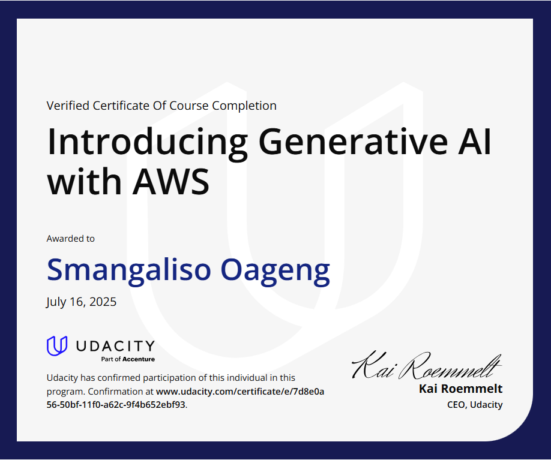

# 🤖 Generative AI with AWS – Machine Learning Exercises

This repository showcases hands-on projects and exercises completed during the **"Introducing Generative AI with AWS"** course on AWS Skill Builder.

It includes practical applications of supervised, unsupervised, and deep learning techniques using Python and Jupyter Notebooks. The exercises use synthetic data to simulate real-world problems.

---

## 🧾 Certificate

---

## 📁 Project Structure

aws-ml-certification-exercises/
├── README.md
├── certificate.pdf
├── partyrock/
│   └── wellnesswise_summary.md
├── supervised_learning/
│   └── energy_efficiency.ipynb
├── unsupervised_learning/
│   └── vehicle_clustering.ipynb
├── decision_tree/
│   └── customer_churn_prediction.ipynb
├── neural_network/
│   └── customer_purchase_prediction.ipynb

---

## 🌐 PartyRock App – WellnessWise

I built a generative AI wellness assistant app on [PartyRock](https://partyrock.aws/u/Smangaliso/i7guYJscW/WellnessWise).

> **WellnessWise** is a generative AI-powered health and wellness advisor. Users input details about their lifestyle and receive recommendations for:
> - Nutrition 🍎  
> - Exercise 🏋️  
> - Sleep 😴  
> - Hydration 💧  
> - Stress management 🧘  

**Note:** This app offers general wellness advice and is not a replacement for professional healthcare.

---

## 📊 Projects & ML Exercises

### 🏠 Supervised Learning – Predicting Building Energy Efficiency
- Trained a `RandomForestRegressor` to predict energy efficiency from building features.
- Visualized pairwise feature relationships.
- Evaluated using Mean Squared Error and prediction scatter plot.
📂 `supervised_learning/energy_efficiency.ipynb`

---

### 🚗 Unsupervised Learning – Vehicle Clustering
- Used `KMeans` to cluster vehicles based on engine size, weight, and horsepower.
- Visualized clusters in 2D using Matplotlib.
📂 `unsupervised_learning/vehicle_clustering.ipynb`

---

### 📉 Decision Tree – Predicting Customer Churn
- Built a `DecisionTreeClassifier` using synthetic telecom data.
- Achieved accuracy measurement.
- Visualized the decision tree using `sklearn.tree.plot_tree`.
📂 `decision_tree/customer_churn_prediction.ipynb`

---

### 🧠 Neural Network – Purchase Prediction
- Built a small neural net using `TensorFlow`/`Keras`.
- Predicts customer purchase behavior based on visit duration and number of pages visited.
- Used sigmoid activation for binary classification.
📂 `neural_network/customer_purchase_prediction.ipynb`

---

## 🚀 Tech Stack

- Python
- Jupyter Notebooks
- scikit-learn
- TensorFlow / Keras
- Matplotlib & Seaborn
- AWS PartyRock

---

## 🔗 Related
- [AWS Skill Builder Course](https://explore.skillbuilder.aws/learn/course/external/view/elearning/17350/introducing-generative-ai-with-aws)
- [My PartyRock App](https://partyrock.aws/u/Smangaliso/i7guYJscW/WellnessWise)
- [My LinkedIn Profile](https://www.linkedin.com/in/smangaliso-oageng-09231b2aa/)
- [My GitHub Portfolio](https://github.com/Smanga1974)

---

## 📌 Status

✅ Completed – July 2025  
📚 Continuing with advanced AWS AI/ML and full-stack projects

